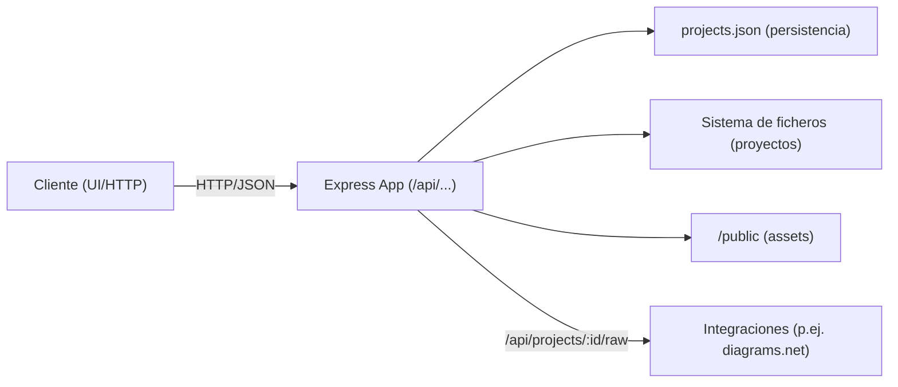

# Java Documentation Viewer

Aplicación web para visualizar documentación de proyectos Java con estructura de carpetas `docs`.

## 🚀 Características

- **Gestión de múltiples proyectos**: Añade tantas rutas de proyectos como necesites
- **Explorador de archivos**: Navega por la estructura de carpetas de cada proyecto
- **Syntax Highlighting**: Código Java con coloreado de sintaxis
- **Visor de Markdown**: Renderizado de archivos `.md` con soporte para tablas, código, etc.
- **Vista dividida**: Visualiza código y documentación lado a lado
- **Enlace automático**: Detecta automáticamente la documentación asociada a cada archivo Java

## 🏗️ Arquitectura

### Backend (`src/`)
- `config/env.js`: variables de entorno, límites de subida y rutas base centralizadas.
- `store/projectStore.js`: persistencia en memoria + lectura/escritura de `projects.json`.
- `services/projectsService.js`: operaciones sobre la jerarquía (carpetas, proyectos, reordenación).
- `services/fileService.js`: lectura/escritura de archivos, árbol de ficheros, documentación y subidas.
- `services/searchService.js`: búsqueda textual recursiva con extensiones permitidas.
- `routes/projectsRouter.js`: API REST agrupada bajo `/api/projects` con manejo de errores homogéneo.
- `app.js`/`server.js`: bootstrap del servidor Express y logging de arranque.

### Frontend (`public/js/`)
- `constants.js`: catálogo de iconos SVG reutilizables.
- `state.js`: estado global y referencias al DOM compartidas entre módulos.
- `ui.js`: lógica de interacción (sidebar, visor, modales, Swagger, drag & drop) expuesta vía `initializeApp`.
- `main.js`: punto de entrada ES Modules que inicializa la aplicación tras `DOMContentLoaded`.

Esta separación permite sustituir o probar capas de forma aislada y evita los archivos monolíticos originales.

## 📋 Requisitos

- Node.js 14 o superior
- npm

## 🔧 Instalación

1. **Navega a la carpeta del proyecto**:
   ```bash
   cd doc-viewer
   ```

2. **Instala las dependencias**:
   ```bash
   npm install
   ```

3. **Inicia el servidor**:
   ```bash
   npm start
   ```

4. **Abre tu navegador** en: http://localhost:3000

## 📁 Estructura esperada del proyecto

La aplicación espera que los proyectos tengan una estructura similar a esta:

```
mi-proyecto/
├── carpeta1/
│   ├── MiClase.java
│   ├── OtraClase.java
│   └── docs/
│       ├── MiClase.md
│       └── OtraClase.md
├── carpeta2/
│   ├── Servicio.java
│   └── docs/
│       └── Servicio.md
└── README.md
```

- Cada carpeta puede contener archivos `.java`
- La documentación se busca en una subcarpeta `docs/` con el mismo nombre pero extensión `.md`

## 🎯 Uso

### Añadir un proyecto

1. Haz clic en **"+ Añadir Proyecto"**
2. Introduce un nombre descriptivo
3. Introduce la ruta absoluta al proyecto (ej: `C:\Users\...\mi-proyecto`)
4. Haz clic en **"Guardar"**

### Navegar archivos

- Haz clic en un proyecto para expandir su estructura
- Haz clic en las carpetas para ver su contenido
- Los archivos Java se muestran con icono ☕
- Los archivos con documentación asociada tienen una etiqueta "DOC"

### Vistas disponibles

- **Código Java**: Muestra el código fuente con syntax highlighting
- **Documentación**: Muestra el archivo Markdown renderizado
- **Vista Dividida**: Muestra ambos paneles lado a lado

### Navegar entre código y documentación

- Usa los botones "Ver Doc" y "Ver Código" para saltar entre vistas
- O usa los tabs en la parte superior para cambiar de vista

## ⚙️ Configuración

Los proyectos se guardan automáticamente en `projects.json` para persistencia entre reinicios.

### Cambiar el puerto

Puedes cambiar el puerto modificando la variable de entorno:

```bash
PORT=8080 npm start
```

O en Windows PowerShell:
```powershell
$env:PORT=8080; npm start
```

## 🛠️ Tecnologías

- **Backend**: Node.js + Express
- **Frontend**: Vanilla JavaScript
- **Syntax Highlighting**: Highlight.js
- **Markdown Rendering**: Marked.js

## 📝 Notas

- La aplicación solo muestra archivos `.java` y `.md`
- Se ignoran automáticamente las carpetas: `node_modules`, `.git`, `target`, `.idea`, `build`
- Los proyectos registrados persisten entre reinicios del servidor

# **DOCUMENTACIÓN APLICACIÓN**

Este servicio Node.js expone una API REST para registrar proyectos locales, navegar su árbol de archivos, vincular documentación técnica en Markdown, buscar texto y gestionar cargas/eliminaciones de archivos. Soporta una estructura jerárquica (carpetas y proyectos) persistida en un archivo JSON.

- Runtime: Node.js + Express
- Persistencia: archivo JSON (projects.json)
- Almacenamiento de archivos: sistema de ficheros local del servidor
- Subidas: multer (memoria), límite 10 MB por archivo
- Seguridad básica: validaciones de ruta para evitar traversal, CORS habilitado
- Arquitectura (alto nivel)



##  Características principales
- Registro de proyectos y organización en carpetas jerárquicas
- Migración automática desde formato antiguo (array) a formato nuevo (árbol con items)
- Exploración de árbol de archivos con filtrado por extensiones relevantes
- Vínculo entre archivos de código (Java/JS/TS) y su documentación Markdown (en subcarpeta docs)
- Búsqueda de texto dentro de archivos seleccionados
- Subida múltiple de archivos a carpetas del proyecto (con control de tamaño)
- Eliminación de archivos y carpetas del proyecto
- Servir archivos raw (útil para iframes de diagrams.net)
- Servir la SPA desde /public

## Puesta en marcha
- Variables de entorno:
  - `PORT`: puerto del servidor (por defecto 80)
  - `DATA_PATH`: ruta persistente para projects.json (útil en OpenShift). Por defecto, __dirname.
- Dependencias (principales): express, cors, multer, fs, path
- Inicio:
  1. Carga o inicializa `projects.json`
  2. Migra formato antiguo si fuese necesario
  3. Publica endpoints y estáticos
 
```mermaid
flowchart TB
  A[Inicio del proceso] --> B[Cargar projects.json - DATA_PATH]
  B -->|Existe| C[Leer y parsear JSON]
  B -->|No o error| D[Inicializar projectsData (items vacíos)]
  C -->|Formato antiguo (array)| E[Convertir a formato jerárquico]
  E --> F[Guardar projects.json]
  C -->|Formato nuevo| G[Asignar projectsData = parsed]
  D --> H[Servidor listo]
  F --> H
  G --> H
```

Modelo de datos (jerárquico)
La persistencia utiliza un objeto raíz con un array items que contiene elementos de tipo folder o project. Los folder contienen a su vez items.

 
Copiar códigoCódigo copiado
classDiagram
  class Root {
    items: Item[]
  }

  class Item {
    id: string
    type: "folder" | "project"
  }

  class Folder {
    id: string
    type: "folder"
    name: string
    items: Item[]
  }

  class Project {
    id: string
    type: "project"
    name: string
    path: string  // ruta absoluta en el servidor
  }

  Root --> Item
  Item <|-- Folder
  Item <|-- Project
Notas:

Identificadores:
Carpeta: "folder-" + timestamp
Proyecto: timestamp como string
El archivo projects.json se guarda en DATA_PATH.
Estructura de archivos de proyectos
El árbol se construye a partir de project.path, filtrando y anotando metadatos.

Directorios ignorados: node_modules, .git, target, .idea, build, docs
Directorios especiales: swagger (marcado con isSwaggerFolder)
Archivos incluidos por extensión:
Código: .java, .js, .ts
Documentación: .md
YAML/Swagger: .yml, .yaml (fileType = "swagger")
Diagramas: .drawio
Relaciones código <-> docs:

Para un archivo de código X.ext, si existe ./docs/X.md, se marca en el item con docPath
Para un archivo Markdown X.md dentro de una carpeta docs, se busca el código fuente hermano X.(java|js|ts) y se marca sourcePath
 
Copiar códigoCódigo copiado
flowchart TD
  A[buildFileTree(basePath,currentPath)] --> B[readdirSync withFileTypes]
  B --> C{entry.isDirectory?}
  C -->|Sí| D[Ignorar dirs especiales (node_modules, .git, target, .idea, build, docs)]
  D -->|Ignorado| B
  D -->|No ignorado| E[children = buildFileTree(...)]
  E --> F[Marcar flags (isSwaggerFolder, isDocsFolder*)]
  F --> G[Push folder + children]
  C -->|No| H[Filtrar por extensiones permitidas]
  H --> I[Determinar fileType]
  I --> J[En código: findDocumentation()]
  J --> K[Si existe, item.docPath]
  I --> L[En .md: findSourceFile()]
  L --> M[Si existe, item.sourcePath]
  G & K & M --> N[Ordenar carpetas primero, luego por nombre]
  N --> O[Devolver items]
Nota: Aunque el código marca isDocsFolder, actualmente el directorio "docs" se ignora explícitamente en el árbol. Los MD siguen siendo accesibles vía endpoints dedicados.

API Reference
Base: /api

Generales:

Respuestas JSON salvo /raw (que sirve contenido con content-type)
Códigos de error comunes: 400 (petición inválida), 403 (acceso denegado), 404 (no encontrado), 500 (error interno)
Proyectos y carpetas
GET /api/projects

Devuelve la estructura jerárquica completa { items: [...] }
PUT /api/projects

Cuerpo: { items: Item[] }
Reemplaza la estructura completa (para drag & drop). Persiste.
POST /api/projects/folder

Cuerpo: { name: string, parentId?: string }
Crea carpeta en raíz o dentro de parentId
PATCH /api/projects/folder/:id

Cuerpo: { name: string }
Renombra carpeta
DELETE /api/projects/folder/:id

Elimina la carpeta. Su contenido se mueve al nivel actual (no se pierde)
POST /api/projects

Cuerpo: { name: string, path: string }
Requisitos:
path debe existir en el filesystem del servidor
No puede estar ya registrado (comparación por path exacto)
Crea un proyecto en el nivel raíz
DELETE /api/projects/:id

Elimina un elemento por id (proyecto o carpeta) en la jerarquía
 
Copiar códigoCódigo copiado
sequenceDiagram
  participant C as Cliente
  participant A as API (/api/projects)
  participant F as FS (projects.json)

  C->>A: POST /api/projects {name, path}
  A->>F: fs.existsSync(path)?
  A-->>C: 400 si no existe
  A->>A: getAllProjects() + exists?
  A-->>C: 400 si duplicado
  A->>F: saveProjects()
  A-->>C: 200 { project }
Archivos de proyecto
GET /api/projects/:id/tree

Devuelve el árbol de archivos filtrado, con metadatos (fileType, docPath, sourcePath, isSwaggerFolder)
GET /api/projects/:id/file?path=relPath

Devuelve contenido, tipo de archivo y fileName
path debe ser relativo al project.path
Seguridad: se rechaza si la ruta resultante sale del proyecto
GET /api/projects/:id/raw?path=relPath

Sirve el archivo en bruto con content-type adecuado (xml/svg/png/jpg/jpeg o text/plain)
Útil para iframes de diagrams.net y visualizaciones externas
Añade Access-Control-Allow-Origin: *
POST /api/projects/:id/upload (multipart/form-data)

Campos:
files: múltiples archivos (máx 20 x 10 MB)
folderPath: ruta relativa dentro del proyecto de destino
Valida:
Proyecto existe
Se adjuntan archivos
La carpeta destino existe y está dentro del proyecto
Respuesta: { success, uploadedFiles: string[], errors: string[], count }
DELETE /api/projects/:id/file

Cuerpo: { filePath: string } (relativo al proyecto)
Elimina archivo o carpeta (recursivo, force) dentro del proyecto
Respuesta: { success, deleted, type: 'file' | 'folder' }
 
Copiar códigoCódigo copiado
flowchart TD
  A[POST /api/projects/:id/upload] --> B[findProjectById(id)]
  B -->|No| X[404 Proyecto no encontrado]
  B --> C{req.files?}
  C -->|No| Y[400 No se han enviado archivos]
  C --> D[targetDir = join(project.path, folderPath)]
  D --> E{targetDir startsWith project.path?}
  E -->|No| Z[403 Acceso denegado]
  E --> F{existsSync(targetDir)?}
  F -->|No| W[400 Carpeta destino no existe]
  F --> G[Iterar archivos y writeFileSync]
  G --> H[Construir uploadedFiles/errors]
  H --> I{uploadedFiles.length > 0?}
  I -->|No| J[500 No se pudo subir ningún archivo]
  I -->|Sí| K[200 { success, uploadedFiles, errors, count }]
Documentación vinculada
GET /api/projects/:id/doc?sourcePath=relSourcePath
Alternativo legacy: ?javaPath=
Construye la ruta a ./docs/.md al lado del código
Respuesta: { content, path, fileName } o 404 si no existe
 
Copiar códigoCódigo copiado
sequenceDiagram
  participant C as Cliente
  participant A as API (/api/projects/:id/doc)
  participant F as FS

  C->>A: GET /doc?sourcePath=src/Feature.java
  A->>A: Derivar mdRelativePath=src/docs/Feature.md
  A->>F: existsSync(mdFullPath)?
  alt existe
    A->>F: readFileSync
    A-->>C: 200 {content, path, fileName}
  else
    A-->>C: 404 Documentación no encontrada
  end
Búsqueda
GET /api/projects/:id/search?q=texto
Busca texto (case-insensitive) en archivos con extensiones: .java, .js, .ts, .md, .yml, .yaml, .drawio
Recorre recursivo el árbol del filesystem (sin tocar node_modules/.git/… si no existen, los omite por lectura normal)
Respuesta: { searchTerm, matchingFiles: string[], count }
 
Copiar códigoCódigo copiado
flowchart TD
  A[GET /api/projects/:id/search?q=...] --> B[findProjectById]
  B -->|No| X[404]
  B --> C{q válido?}
  C -->|No| Y[400]
  C --> D[searchInDirectory(project.path)]
  D --> E[Para cada item: statSync]
  E -->|Dir| D
  E -->|File permitido| F[readFileSync + includes(searchTerm)]
  F -->|Sí| G[matchingFiles.push(relPath)]
  D --> H[200 { matchingFiles, count }]
Ejemplos de uso (curl)
Registrar proyecto
 
Copiar códigoCódigo copiado
curl -X POST http://localhost:80/api/projects \
  -H "Content-Type: application/json" \
  -d '{"name":"Mi Proyecto","path":"/ruta/absoluta/al/proyecto"}'
Crear carpeta en raíz
 
Copiar códigoCódigo copiado
curl -X POST http://localhost:80/api/projects/folder \
  -H "Content-Type: application/json" \
  -d '{"name":"Backend"}'
Subir archivos a carpeta src/main/resources
 
Copiar códigoCódigo copiado
curl -X POST "http://localhost:80/api/projects/123456/upload" \
  -F "folderPath=src/main/resources" \
  -F "files=@local/file1.yml" \
  -F "files=@local/file2.yaml"
Descargar archivo raw (para iframe)
 
Copiar códigoCódigo copiado
curl "http://localhost:80/api/projects/123456/raw?path=docs/diagrama.drawio" -i
Obtener documentación vinculada de una clase
 
Copiar códigoCódigo copiado
curl "http://localhost:80/api/projects/123456/doc?sourcePath=src/com/app/Feature.java"
Persistencia y migración
Ruta: ${DATA_PATH}/projects.json
Migración automática:
Si el JSON previo es un array simple de proyectos, se convierte a { items: [{ type:'project', ...}] } y se guarda en el nuevo formato.
Operaciones de escritura/lectura: síncronas (fs.readFileSync/writeFileSync) para simplicidad.
Ejemplo (nuevo formato):

JSON 
Copiar códigoCódigo copiado
{
  "items": [
    { "type": "folder", "id": "folder-1700000000000", "name": "Team A", "items": [] },
    { "type": "project", "id": "1700000001000", "name": "Mi Servicio", "path": "/srv/projects/service" }
  ]
}
Middleware y configuración
cors(): habilitado globalmente
express.json(): parseo de JSON en cuerpos
express.static('public'): sirve la SPA y assets
multer.memoryStorage(): subidas en memoria (10 MB por archivo, máx 20 por petición)
Seguridad y buenas prácticas
Implementadas:

Comprobación de contención: se verifica que operaciones de archivos se hagan dentro de project.path usando startsWith
Límite de tamaño de archivos en upload
CORS habilitado (y en /raw se fuerza Access-Control-Allow-Origin: *)
Consideraciones/mejoras recomendadas:

Normalización fuerte de rutas con path.resolve y comparación con path.relative para proteger mejor contra traversal y symlinks
Autenticación/autorización (actualmente no hay)
Uso de operaciones asíncronas de FS para evitar bloquear el event loop en proyectos grandes
Control de tipos MIME más estricto en /raw si se expone a terceros
Manejo de conflictos de escritura y concurrencia (actualmente operaciones síncronas)
Revisión de la lista de directorios ignorados: actualmente se ignora "docs" en el árbol; si se desea mostrarlo en el árbol, hay que quitarlo de la lista de ignorados
Revisión de la construcción de docPath en findDocumentation: el path devuelto puede no ser relativo al root del proyecto; validar contra el consumo en el frontend
Flujo de eliminación de carpetas (reparenting)
Al eliminar una carpeta organizativa (estructura jerárquica de proyectos), su contenido se mueve al nivel actual en el árbol (no se borra).

 
Copiar códigoCódigo copiado
flowchart TD
  A[DELETE /api/projects/folder/:id] --> B[deleteFolder(items)]
  B --> C{items[i].id === id && type==='folder'?}
  C -->|Sí| D[folder = items[i]; items.splice(i, 1, ...folder.items)]
  C -->|No| E[Recorrer subcarpetas recursivamente]
  D --> F[saveProjects(); 200 {success:true}]
  E -->|No encontrado| G[404 Carpeta no encontrada]
Mapa de endpoints y estados
200 OK: Operación exitosa
400 Bad Request: Falta parámetro, estructura inválida, ruta inexistente
403 Forbidden: Ruta objetivo fuera del proyecto
404 Not Found: Proyecto/carpeta/archivo no encontrado
500 Internal Server Error: Errores de E/S u otros imprevistos
Límites y supuestos
Los paths de proyectos deben existir físicamente en el servidor
No hay validación de nombres de archivo/carpeta aparte de las comprobaciones de ruta
El árbol de archivos puede ser costoso en repos grandes (lecturas síncronas)
La búsqueda recorre de forma recursiva y lectura completa de ficheros permitidos; en repositorios grandes puede tardar
Rutas de la aplicación
GET /: sirve public/index.html (aplicación principal)
/public: estáticos (JS/CSS/imagenes de la UI)